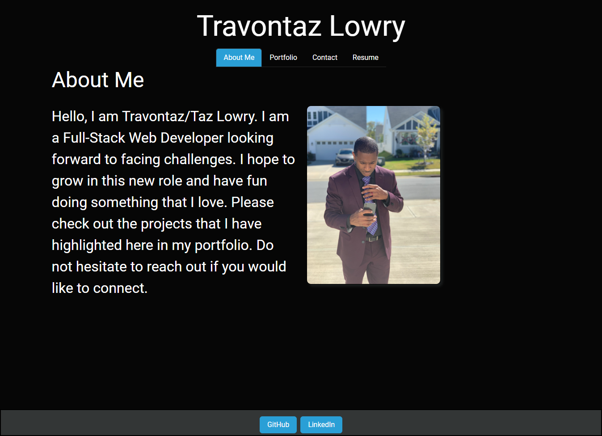
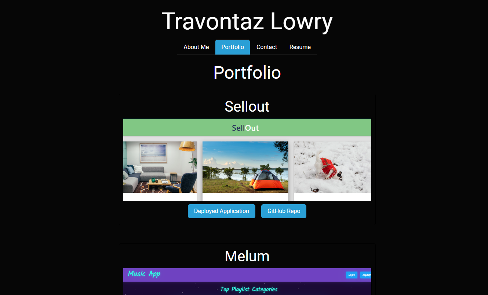
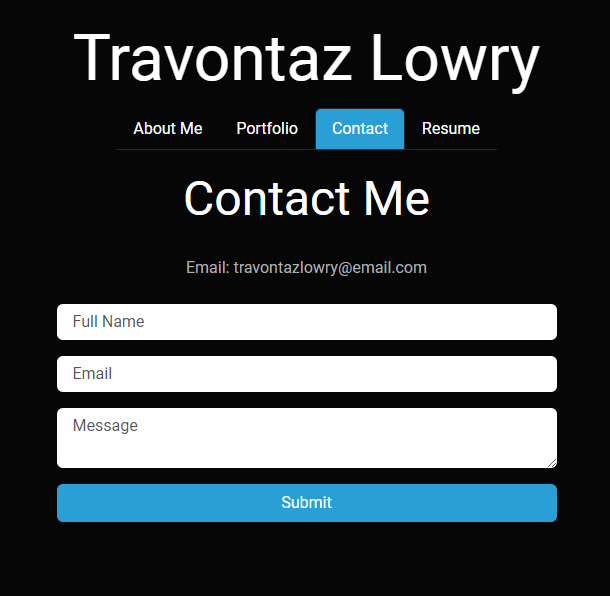
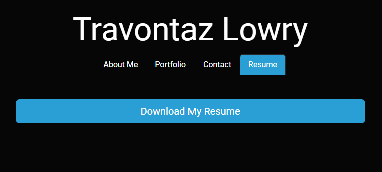

# react-portfolio

[Link to my project](https://github.com/Deiontre10/react-portfolio)  

[Link to deployed site](https://deiontre10.github.io/react-portfolio/)

## Table of Contents
- [Description](#description)
- [Visuals](#visuals)

## Description

## Visuals

About:  

Portfolio:  

Contact:  

Resume:  

